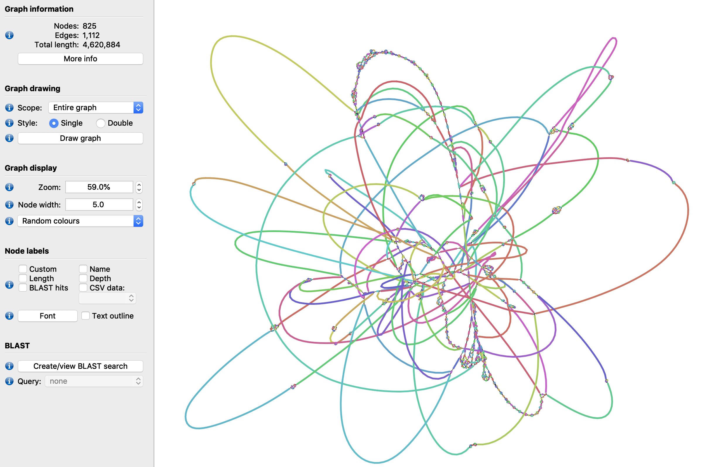
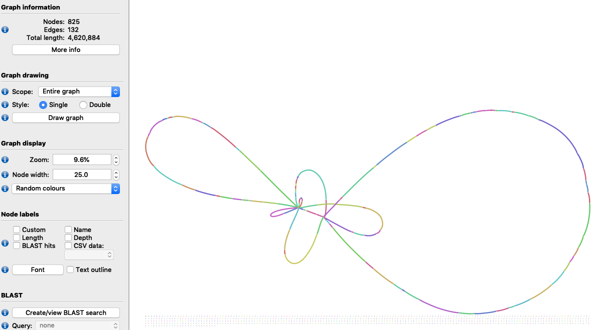
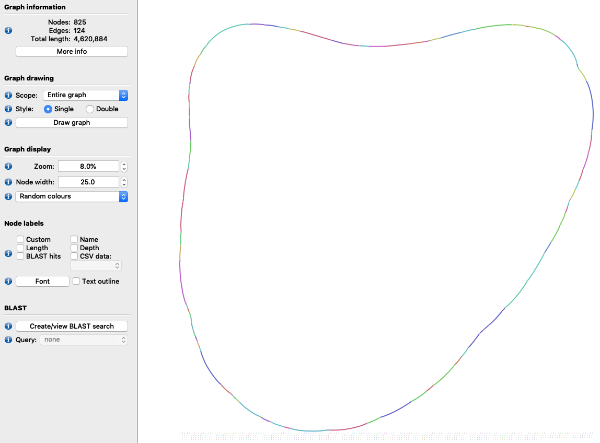

# LinkageMaker & LinkageUntangler

One of main uses of SDG is to project longer-range information into an assembly graph, to be able to resolve complex regions into longer linear sequences. These types of analyses can be used for what is commonly called "repeat resolution", "scaffolding" and "haplotype phasing".

In SDG, all these concepts map to analyses of linkage. 


## Example #1: scaffolding a bacterial genome with long reads

For this example we can create the initial graph and datastores from the sdg-dbg CLI tool:

```shell
sdg-datastore make -t paired -o ecoli_pe -1 ../ecoli_pe_r1.fastq -2 ../ecoli_pe_r2.fastq
sdg-datastore make -t long -o ecoli_pb -L ../ecoli_pb_all.fastq
sdg-dbg -p ecoli_pe.prseq -o ecoli_assm
```

From this point on, we use the python SDG library. First, we load the workspace, add a long read datastore, and the long reads datastore, and map its reads using a k=11 index:

```python
import pysdg as SDG
# Load sdg-dbg's workspace from disk, add the pacbio datastore
ws=SDG.WorkSpace('ecoli_assm.bsgws')
lords=ws.add_long_reads_datastore('ecoli_pb.loseq')
# Map long reads
lords.mapper.k=11
lords.mapper.map_reads()
```

We can check how the initial graph looks like by dumping it to a [GFAv1](https://github.com/GFA-spec/GFA-spec/blob/master/GFA1.md) file and opening it in [Bandage](https://rrwick.github.io/Bandage/):

```python
ws.sdg.write_to_gfa1('initial_graph.gfa')
```



Now we can use the LinkageMaker to create linkage with the long reads datastore. We do this by selecting the nodes between which to analyse posible linkage, in this case all nodes of 1100bp or more, and then calling the make_longreads_multilinkage method, setting alignment filtering parameters of 1000bp and 10% id:

```python
lm=SDG.LinkageMaker(ws.sdg)
lm.select_by_size(1100)
lr_mldg=lm.make_longreads_multilinkage(ws.long_reads_datastores[0].mapper,1000,10)
```

This linkage contains a link between two nodes every time they map to the same long read. This means it actually contains many links for the same consecutive nodes, which can be checked through its NodeViews:


```python
node3=lr_mldg.get_nodeview(3)
for n in node3.next(): print("NEXT: ",n)
for p in node3.prev(): print("PREV: ",p)
```

```
NEXT:  < NodeDistanceView: -210bp to -596 >
NEXT:  < NodeDistanceView: -66bp to -596 >
NEXT:  < NodeDistanceView: -64bp to -596 >
NEXT:  < NodeDistanceView: -63bp to -596 >
NEXT:  < NodeDistanceView: -62bp to -596 >
NEXT:  < NodeDistanceView: -62bp to -596 >
NEXT:  < NodeDistanceView: -62bp to -596 >
NEXT:  < NodeDistanceView: -62bp to -596 >
NEXT:  < NodeDistanceView: -62bp to -596 >
NEXT:  < NodeDistanceView: -62bp to -596 >
NEXT:  < NodeDistanceView: -61bp to -596 >
NEXT:  < NodeDistanceView: -61bp to -596 >
NEXT:  < NodeDistanceView: -61bp to -596 >
NEXT:  < NodeDistanceView: -61bp to -596 >
NEXT:  < NodeDistanceView: -61bp to -596 >
NEXT:  < NodeDistanceView: -61bp to -596 >
NEXT:  < NodeDistanceView: -61bp to -596 >
NEXT:  < NodeDistanceView: -61bp to -596 >
NEXT:  < NodeDistanceView: -61bp to -596 >
NEXT:  < NodeDistanceView: -61bp to -596 >
NEXT:  < NodeDistanceView: -60bp to -596 >
NEXT:  < NodeDistanceView: -60bp to -596 >
NEXT:  < NodeDistanceView: -60bp to -596 >
NEXT:  < NodeDistanceView: -59bp to -596 >
NEXT:  < NodeDistanceView: -59bp to -596 >
NEXT:  < NodeDistanceView: -57bp to -596 >
NEXT:  < NodeDistanceView: 46bp to -596 >
NEXT:  < NodeDistanceView: 8621bp to 696 >
NEXT:  < NodeDistanceView: 9347bp to 696 >
PREV:  < NodeDistanceView: 1034bp to 323 >
PREV:  < NodeDistanceView: 1074bp to 323 >
PREV:  < NodeDistanceView: 1097bp to 323 >
PREV:  < NodeDistanceView: 4623bp to -1104 >
PREV:  < NodeDistanceView: 1122bp to 323 >
PREV:  < NodeDistanceView: 4592bp to -1104 >
PREV:  < NodeDistanceView: 1125bp to 323 >
PREV:  < NodeDistanceView: 1128bp to 323 >
PREV:  < NodeDistanceView: 1139bp to 323 >
PREV:  < NodeDistanceView: 1139bp to 323 >
PREV:  < NodeDistanceView: 4670bp to -1104 >
PREV:  < NodeDistanceView: 4742bp to -1104 >
PREV:  < NodeDistanceView: 4800bp to -1104 >
PREV:  < NodeDistanceView: 4872bp to -1104 >
PREV:  < NodeDistanceView: 1145bp to 323 >
PREV:  < NodeDistanceView: 1150bp to 323 >
PREV:  < NodeDistanceView: 1156bp to 323 >
PREV:  < NodeDistanceView: 1179bp to 323 >
PREV:  < NodeDistanceView: 1183bp to 323 >
PREV:  < NodeDistanceView: 1186bp to 323 >
PREV:  < NodeDistanceView: 1192bp to 323 >
PREV:  < NodeDistanceView: 1219bp to 323 >
PREV:  < NodeDistanceView: 1233bp to 323 >
```

This multi-linkage can be collapsed using the LinkageUntangler. The make_nextselected_linkage() method links every selected node to its closest selected neighbours FW and BW, aggregating the distances via a simple median calculation:

```python
lu=SDG.LinkageUntangler(lr_mldg)
lu.select_by_size(1100)
ns_dg=lu.make_nextselected_linkage()
```

Now the links on the same node look quite simpler:

```python
node3=ns_dg.get_nodeview(3)
for n in node3.next(): print("NEXT: ",n)
for p in node3.prev(): print("PREV: ",p)
```

```
NEXT:  < NodeDistanceView: -61bp to -596 >
PREV:  < NodeDistanceView: 1145bp to 323 >
```

If we plot this new distance graph with the collapsed linkage, it is quite a bit more resolved already:

```python
ns_dg.write_to_gfa1('ns_collapsed.gfa')
```



But we can still solve this more by getting rid of those repetitions. It is easy to find some posible repetitive nodes in a simple graph like this: they will be connected to multiple neighbours, as each of them belongs in more than one place. There can be some sections in the middle of a repetition that have only one neighbour fw and back, but on this simple genome that is not the case. A simple exploration of the NodeViews for the graph can give us the detail:

```python
for nv in ns_dg.get_all_nodeviews():
    if len(nv.prev())>1 or len(nv.next())>1:
        print("\nnode %d (%d bp) is a repeat:"%(nv.node_id(),nv.size()))
        for p in nv.prev(): print(" ",p," -> IN")
        for n in nv.next(): print(" OUT -> ",n)
```


```
node 1508 (1345 bp) is a repeat:
  < NodeDistanceView: -51bp to -1490 >  -> IN
  < NodeDistanceView: -50bp to -414 >  -> IN
  < NodeDistanceView: -50bp to -413 >  -> IN
 OUT ->  < NodeDistanceView: -71bp to -1473 >
 OUT ->  < NodeDistanceView: -71bp to -680 >
 OUT ->  < NodeDistanceView: -61bp to 1511 >

node 1542 (1255 bp) is a repeat:
  < NodeDistanceView: -61bp to 1274 >  -> IN
  < NodeDistanceView: -57bp to 369 >  -> IN
  < NodeDistanceView: -56bp to 1549 >  -> IN
  < NodeDistanceView: -52bp to 1214 >  -> IN
  < NodeDistanceView: -52bp to 1562 >  -> IN
 OUT ->  < NodeDistanceView: -70bp to -906 >
 OUT ->  < NodeDistanceView: -70bp to -267 >
 OUT ->  < NodeDistanceView: -70bp to -153 >
 OUT ->  < NodeDistanceView: -61bp to 827 >
 OUT ->  < NodeDistanceView: -61bp to 1543 >
```


But rather than just checking how they look, we can deselect the nodes in the LinkageUntangler (by turning its position in the selection vector off), and generate the linkage again. This should generate long links  between the adjacent nodes, effectively skipping over these repeats which are only around 1Kbp each, assuming there are actually reads that span the repeats:

```python
for nv in ns_dg.get_all_nodeviews():
    if len(nv.prev())>1 or len(nv.next())>1:
        lu.selected_nodes[nv.node_id()]=False
ns_nr_dg=lu.make_nextselected_linkage()
```

It is interesting to check, as an example, what happen to node 1274 (the first one entering the second repeat):

```python
node1490=ns_nr_dg.get_nodeview(1274)
for n in node1490.next(): print("NEXT: ",n)
for p in node1490.prev(): print("PREV: ",p)
```

```
NEXT:  < NodeDistanceView: 1177bp to 827 >
PREV:  < NodeDistanceView: 862bp to 229 >
```

The connectio to the repeat is not there anymore, and a direct connection to node 827 has replaced that, leaving a repeat-size gap in.

This new graph now will have a familiar topology:

```python
ns_nr_dg.write_to_gfa1('ns_nr_final.gfa')
```

