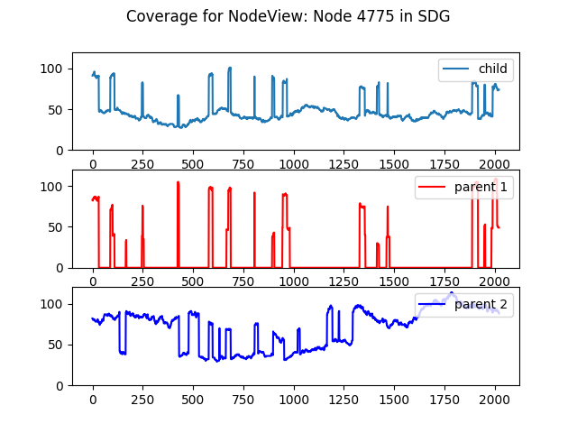
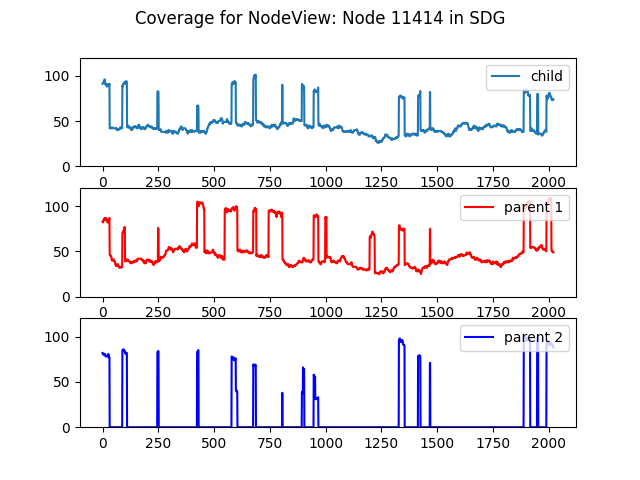

## Exploring a short-read trio simulation with KmerCounts

In this example, we will use the paired reads from the [PseudoSeq.jl trio dataset](../datasets/datasets.md#PseudoSeq.jl-trio). As explained in the dataset description this is a simplified scenario to showcase the analysis in a simple manner.

We will create a DBG from the child reads using sdg-dbg, and add k-mer counts for both parents into the datastore. This will enable us to do parentage-based node-classification, loosely inspired by the analysis on the [Trio-Canu paper](https://www.nature.com/articles/nbt.4277).

### Creating the WorkSpace

First, a PE reads datastore and sdg-dbg to create an assembly graph to work on.

```shell
sdg-datastore make -t paired -1 child/child-pe-reads_R1.fastq -2 child/child-pe-reads_R2.fastq -o child_pe
sdg-dbg sdg-dbg -p child_pe.prseq -o sdg_child
```

Now we can add the counts from the parents, directly into the count file.

```shell
sdg-kmercounter add -c main.sdgkc -n p1 -f p1/p1-pe-reads_R1.fastq -f p1/p1-pe-reads_R2.fastq -o main
sdg-kmercounter add -c main.sdgkc -n p2 -f p2/p2-pe-reads_R1.fastq -f p2/p2-pe-reads_R2.fastq -o main
```

### A heterozygous bubble analysis

```python
import pysdg as SDG
ws=SDG.WorkSpace('sdg_child.sdgws')
print(ws.ls())
```

Now we can use the NodeView::parallels() method to check every node as a possible "bubble" node, and pick the largest node that has a parallel, just to check the properties of parental coverage:

```python
maxbubble=0
for nv in ws.sdg.get_all_nodeviews():
  if nv.size()>maxbubble and len(nv.parallels())==1:
    maxbubble=nv.size()
    bubble_nvs=(nv,nv.parallels()[0])
```

We can now check the nodes in bubble_nvs are really parallel:

```python
for x in bubble_nvs[0].prev(): print("bubble_nvs[0].prev:",x)
for x in bubble_nvs[1].prev(): print("bubble_nvs[1].prev:",x)
for x in bubble_nvs[0].next(): print("bubble_nvs[0].next:",x)
for x in bubble_nvs[1].next(): print("bubble_nvs[1].next:",x)
```

```
bubble_nvs[0].prev: LinkView: -62bp to Node 260
bubble_nvs[1].prev: LinkView: -62bp to Node 260
bubble_nvs[0].next: LinkView: -62bp to Node -2126
bubble_nvs[1].next: LinkView: -62bp to Node -2126
```


And we can produce a nice pair of plots with their coverage in the parents and child:

```python
def plot_kcov(nv):
    figure();suptitle("Coverage for "+str(nv));
    subplot(3,1,1);ylim((0,120))
    plot(nv.kmer_coverage("main","PE"),label="child");legend(loc=1);
    subplot(3,1,2);ylim((0,120))
    plot(nv.kmer_coverage("main","p1"),"red",label="parent 1");legend(loc=1);
    subplot(3,1,3);ylim((0,120))
    plot(nv.kmer_coverage("main","p2"),"blue",label="parent 2");legend(loc=1);

plot_kcov(bubble_nvs[0])
plot_kcov(bubble_nvs[1])
```








### Reconstructing a "uni-parental" path

To construct a Phased-contig from a single parent origin, we can follow a simple algorithm:

1) Start at a any contig that is haplotype-specific contig, and check which parent fully covers it, we will call this the target parent.

2) Advance through the graph (fordard and backward) as long as:

​	a) We have not reached a node we already included (to break cycles)

​	b) There is a single adjacent node, which is covered by both parents. In which case we advance to it.

​	c) There are two adjacent nodes, of which one is fully covered by the target parent but not by the non-target parent, and the other is fully covered by the non-target parent and not by the target parent. In which case we advance to the node covered by the target parent.


