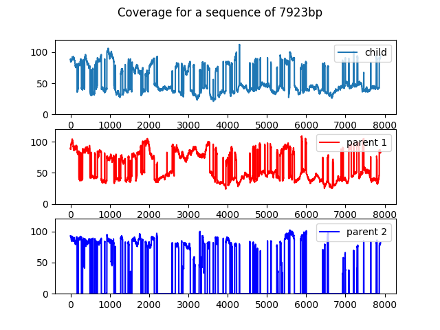
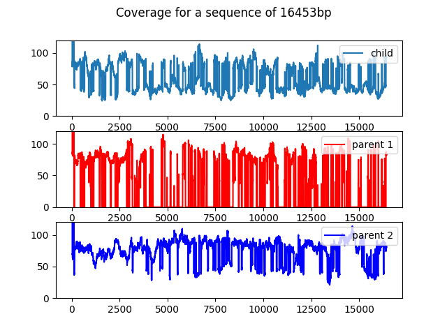

## Exploring a short-read trio simulation with KmerCounts

In this example, we will use the paired reads from the [PseudoSeq.jl trio dataset](../datasets/datasets.md#PseudoSeq.jl-trio). As explained in the dataset description this is a simplified scenario to showcase the analysis in a simple manner.

We will create a DBG from the child reads using sdg-dbg, and add k-mer counts for both parents into the datastore. This will enable us to do parentage-based node-classification, loosely inspired by the analysis on the [Trio-Canu paper](https://www.nature.com/articles/nbt.4277).

### Creating the WorkSpace

First, a PE reads datastore and sdg-dbg to create an assembly graph to work on.

```shell
sdg-datastore make -t paired -1 child/child-pe-reads_R1.fastq -2 child/child-pe-reads_R2.fastq -o child_pe
sdg-dbg sdg-dbg -p child_pe.prseq -o sdg_child
```

Now we can add the counts from the parents, directly into the count file.

```shell
sdg-kmercounter add -c main.sdgkc -n p1 -f p1/p1-pe-reads_R1.fastq -f p1/p1-pe-reads_R2.fastq -o main
sdg-kmercounter add -c main.sdgkc -n p2 -f p2/p2-pe-reads_R1.fastq -f p2/p2-pe-reads_R2.fastq -o main
```

### A heterozygous bubble analysis

```python
import pysdg as SDG
ws=SDG.WorkSpace('sdg_child.sdgws')
print(ws.ls())
```

Now we can use the NodeView::parallels() method to check every node as a possible "bubble" node, and pick the largest node that has a parallel, just to check the properties of parental coverage:

```python
maxbubble=0
for nv in ws.sdg.get_all_nodeviews():
  if nv.size()>maxbubble and len(nv.parallels())==1:
    maxbubble=nv.size()
    bubble_nvs=(nv,nv.parallels()[0])
```

We can now check the nodes in bubble_nvs are really parallel:

```python
for x in bubble_nvs[0].prev(): print("bubble_nvs[0].prev:",x)
for x in bubble_nvs[1].prev(): print("bubble_nvs[1].prev:",x)
for x in bubble_nvs[0].next(): print("bubble_nvs[0].next:",x)
for x in bubble_nvs[1].next(): print("bubble_nvs[1].next:",x)
```

```
bubble_nvs[0].prev: LinkView: -62bp to Node 260
bubble_nvs[1].prev: LinkView: -62bp to Node 260
bubble_nvs[0].next: LinkView: -62bp to Node -2126
bubble_nvs[1].next: LinkView: -62bp to Node -2126
```


And we can produce a nice pair of plots with their coverage in the parents and child:

```python
def plot_kcov(nv):
    figure();subtitle("Coverage for "+str(nv));
    subplot(3,1,1);ylim((0,120))
    plot(nv.kmer_coverage("main","PE"),label="child");legend(loc=1);
    subplot(3,1,2);ylim((0,120))
    plot(nv.kmer_coverage("main","p1"),"red",label="parent 1");legend(loc=1);
    subplot(3,1,3);ylim((0,120))
    plot(nv.kmer_coverage("main","p2"),"blue",label="parent 2");legend(loc=1);

plot_kcov(bubble_nvs[0])
plot_kcov(bubble_nvs[1])
```


### Reconstructing a "uni-parental" path

To construct a Phased-contig from a single parent origin, we can follow a simple idea algorithm:
1. Start with a path with only one node, present in the parent (i.e. it's k-mers coverede by it).
2. While there is only one node forward covered by the parent, add it to the path, and repeat.
3. Once there are no more nodes forward, or more than one node forward is covered by the parent, reverse the path, so the last node is the initial node but in oposite direction.
4. While there is only one node forward covered by the parent, add it to the path, and repeat.
5. Reverse the path again, for it to be in the same orientation of the starting node.

In python, this can be done with this function:
```python
def extend_parent_covered_path(starting_node,target_parent):
  if ws.sdg.get_nodeview(starting_node).kmer_coverage("main",target_parent).count(0)!=0:
    return SDG.SequenceDistanceGraphPath(ws.sdg,[])
  p=SDG.SequenceDistanceGraphPath(ws.sdg,[starting_node])
  for x in [0,1]:
    nv=ws.sdg.get_nodeview(p.nodes[-1])
    while nv.next():
      next_node=0
      for nl in nv.next():
        if nl.node().kmer_coverage("main",target_parent).count(0)==0:
          if next_node or nl.node().node_id() in p.nodes:
            next_node=0
            break
          else:
            next_node=nl.node().node_id()
      if next_node==0: break
      p.nodes.append(next_node)
      nv=ws.sdg.get_nodeview(next_node)
    p.reverse()
  return p
```


Interestingly, going back to the bubble between nodes 11414 and 4775 and extending their paths along their respective parents of sequence origin will return paths of different length:

```python
path1=extend_parent_covered_path(11414,"p1")
path2=extend_parent_covered_path(4775,"p2")
print(len(path1.sequence()),len(path2.sequence()))

```

```
7923 16453
```


This actually makes sense if we remember we are not "phasing bubbles" but following unique paths of coverage. The path of the parent "p1" clearly has some repeat, tip or other complication which does not affect the path of "p2".

As a final check, we can make sure each path is covered by the appropriate parent, by repurposing the k-mer coverage plot function to plot coverage of sequences rather than nodes:

```python
def plot_seq_kcov(seq):
    figure();suptitle("Coverage for a sequence of %dbp"%len(seq));
    subplot(3,1,1);ylim((0,120))
    plot(ws.get_kmer_counter("main").project_count("PE",seq),label="child");legend(loc=1);
    subplot(3,1,2);ylim((0,120))
    plot(ws.get_kmer_counter("main").project_count("p1",seq),"red",label="parent 1");legend(loc=1);
    subplot(3,1,3);ylim((0,120))
    plot(ws.get_kmer_counter("main").project_count("p2",seq),"blue",label="parent 2");legend(loc=1);

plot_seq_kcov(path1.sequence())
plot_seq_kcov(path2.sequence())
```







And this concludes, this example. The rest, as usually said, is left as an excercise to the reader.
